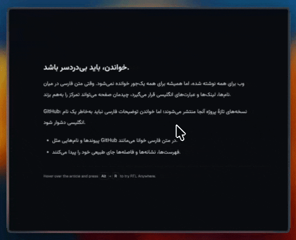

# RTL Anywhere

Make any piece of text on any website right-to-left — with one shortcut.

RTL Anywhere is a small Tampermonkey/Violentmonkey userscript for mixed-direction reading and writing. It is built for moments where one paragraph, one comment, one editor field, or one page section should become RTL without changing the whole website.



## Install

1. Install [Tampermonkey](https://www.tampermonkey.net/) or Violentmonkey.
2. Click **[Install RTL Anywhere](https://raw.githubusercontent.com/sadeqi-ah/rtl-anywhere/main/rtl-anywhere.user.js)**.
3. Confirm the userscript manager prompt.

To update later, use your userscript manager's update action, or reinstall from the same link.

## Quick start

- Hover an element and press `Alt+R` / `⌥R` to toggle it RTL.
- Select text and press `Alt+R` / `⌥R` to RTL only that selected text.
- Press `Alt+Shift+R` / `⌥⇧R` for pick mode when you want precise visual selection.
- Press `Alt+Shift+Z` / `⌥⇧Z` to undo all changes on the current page.

Pressing the toggle shortcut again on an RTL element reverts it.

## Usage

| Shortcut (default)    | Action                                                                 |
| --------------------- | ---------------------------------------------------------------------- |
| `Alt+R` / `⌥R`        | Toggle RTL on the selected text, or the element under the cursor       |
| `Alt+Shift+R` / `⌥⇧R` | Pick mode: hover to preview, click to toggle. Stays active until `Esc` |
| `Alt+Shift+Z` / `⌥⇧Z` | Undo everything on the current page                                    |
| `Esc`                 | Exit pick mode / close settings / dismiss onboarding                   |

### Pick mode

| Key                     | Action                                           |
| ----------------------- | ------------------------------------------------ |
| click                   | Toggle RTL on the highlighted element            |
| `⇧`+click               | Toggle **and remember** it for this site         |
| `↑` / `↓`, or `⌥`+wheel | Move the selection to the parent / child element |
| `Esc`                   | Exit                                             |

All three main actions are also available from the Tampermonkey menu, next to **Settings…**.

## Features

- Toggle a full element or only the currently selected text
- Precise pick mode with parent/child depth control
- Per-site remembered selectors with `⇧`+click
- Optional auto-detect for Persian, Arabic, and Hebrew text
- Optional custom font for RTL text
- Customizable shortcuts
- DevTools-style overlay that is not clipped by `overflow: hidden`
- Code, `pre`, math, editors, icon fonts, emoji, and SVG are protected from accidental styling
- Local-only settings through userscript storage
- No tracking, analytics, `fetch`, or `GM_xmlhttpRequest`

## Auto-detect

Auto-detect can make paragraphs RTL automatically when at least 60% of their letters are Persian, Arabic, Hebrew, or another RTL script covered by the detector.

It is intentionally conservative:

- Off by default
- Can be enabled globally or only for the current site
- Leaves pages alone when they already render RTL
- Skips code, math, editors, and protected regions
- Re-applies to content loaded later through the page observer

## Settings

Tampermonkey menu → **Settings…**


| Tab           | What's in it                                                            |
| ------------- | ----------------------------------------------------------------------- |
| **Font**      | Font search / free-text entry and "Load system fonts"                   |
| **Shortcuts** | Rebind any of the three shortcuts, or reset to defaults                 |
| **Auto**      | Auto-detect globally or only on the current site                        |
| **Sites**     | Selectors remembered for the current hostname, and **Forget this site** |

> **Font list:** "Load system fonts" uses the Local Font Access API in supported Chromium browsers. It requires an HTTPS page and a user gesture. On unsupported browsers, type the font name manually.

## What is saved

Everything is stored locally through Tampermonkey's own storage (`GM_setValue`):

- selected RTL font
- cached system font names
- shortcut bindings
- global auto-detect setting
- per-site auto-detect setting
- per-site selectors remembered with `⇧`+click

One-off toggles are **not** saved. Reloading a page restores the site's original layout unless auto-detect is on or an element matches a remembered selector for that site.

## Development

Requirements:

- Node.js `>=22.18`
- pnpm `10.27.0`

Install dependencies:

```bash
pnpm install
```

Build the userscript:

```bash
pnpm run build
```

Run all checks:

```bash
pnpm run check
```

`check` runs formatting, TypeScript, Node logic tests, the privacy/security scan, a build, verifies that the committed userscript bundle is not stale, and runs the automated browser smoke test. GitHub Actions runs the same command, so CI and local checks should stay aligned.

Verify only the committed bundle:

```bash
pnpm run check:bundle
```

Run only the network API safety scan:

```bash
pnpm run test:security
```

### Local UI harness

Use the harness when developing UI states without reinstalling the userscript:

```bash
pnpm run dev:harness
```

Then open:

```text
test/harness.html
```

The harness shims the Tampermonkey APIs and includes local scenarios for:

- auto-detect content
- protected code/pre content
- pick-mode targets
- remembered selectors
- overflow clipping checks
- contenteditable fallback behavior
- settings panel states
- font permission mocks
- onboarding replay
- light/dark theme checks

### Tests

Pure logic and security tests:

```bash
pnpm test
```

Browser smoke test:

```bash
pnpm run test:smoke
```

The smoke test serves `test/smoke.html`, opens it in Playwright/Chromium, waits for PASS/FAIL output, and exits non-zero on failures or page errors. It covers auto-detect, remembered site rules, selection handling, editable handling, onboarding, settings toggles, shortcut recording, menu commands, and overlay/HUD behavior.

### Security and privacy review

Before changing permissions, storage, or page integration behavior, review [SECURITY.md](SECURITY.md).

## Project structure

| Path                     | Purpose                                                         |
| ------------------------ | --------------------------------------------------------------- |
| `src/main.ts`            | Entry point: menu commands, keyboard handling, observer wiring  |
| `src/core.ts`            | Apply/revert/toggle logic for elements and text selections      |
| `src/auto.ts`            | Auto-detect scanning and per-site/global auto state             |
| `src/pick.ts`            | Pick mode, hover tracking, depth navigation                     |
| `src/overlay.ts`         | Overlay behavior: hover boxes, feedback tags, HUD, beam toggle  |
| `src/overlay-markup.ts`  | Shadow-root markup and CSS for the overlay/HUD/beam             |
| `src/panel.ts`           | Settings panel behavior and event wiring                        |
| `src/panel-markup.ts`    | Settings panel markup                                           |
| `src/ui-css.ts`          | Shared UI CSS for onboarding/settings surfaces                  |
| `src/onboard.ts`         | First-run onboarding card                                       |
| `src/sites.ts`           | Remembered selector application                                 |
| `src/selector.ts`        | Stable selector generation guards                               |
| `src/keys.ts`            | Shortcut parsing, formatting, matching                          |
| `src/shortcuts.ts`       | Shortcut persistence and recorder behavior                      |
| `src/styles.ts`          | Injected RTL typography/style rules                             |
| `.github/workflows/`     | CI workflow running the unified local check command             |
| `test/logic.test.ts`     | Node tests for pure logic                                       |
| `test/security-scan.mjs` | Network API safety scan                                         |
| `test/smoke.html`        | Browser smoke page                                              |
| `test/smoke-runner.mjs`  | Automated Playwright smoke runner                               |
| `test/harness.html`      | Manual local development harness                                |
| `build.mjs`              | Bundles `src/main.ts` into `rtl-anywhere.user.js` with metadata |

## Permissions

The userscript asks for broad access because the feature is broad: it needs to be ready on whatever page you decide to toggle.

| Grant                         | Why                                                                                                     |
| ----------------------------- | ------------------------------------------------------------------------------------------------------- |
| `@match *://*/*`              | "Anywhere" is the feature — the script must be available on any page where you press the shortcut       |
| `unsafeWindow`                | Only to call `queryLocalFonts()` on the real page window; it fails through the userscript sandbox proxy |
| `GM_getValue` / `GM_setValue` | Store settings locally in the userscript manager                                                        |
| `GM_addStyle`                 | Inject the RTL typography and UI styles                                                                 |
| `GM_registerMenuCommand`      | Add Pick mode, Undo, and Settings actions to the userscript menu                                        |

There is no `GM_xmlhttpRequest`, no `fetch`, no remote config, and no analytics.

## Troubleshooting

### The font list does not load

The Local Font Access API is browser- and context-dependent. Try opening Settings on an HTTPS page in Chrome/Edge/Brave. If permission is blocked, use the browser site settings to allow font access, or type the font name manually.

### A code block became RTL

Add a more specific selector to `PROTECTED` in `src/constants.ts`, then add a smoke/harness case for that site pattern.

### The wrong element toggles

Use pick mode and adjust depth with `↑` / `↓` or `⌥`+wheel before clicking. If the choice should persist, use `⇧`+click to remember the selector for the site.

### The onboarding card does not appear

It is shown once and only in the top frame. In the local harness, use **Show onboarding** to replay it.

### `pnpm run check` changed `rtl-anywhere.user.js`

The distributable userscript is committed so the raw GitHub install link can serve it. Run `pnpm run build`, review the generated diff, and commit the updated `rtl-anywhere.user.js` with the related source change.

### The install link uses `rtl-anywhere`

That is intentional. The distributed userscript metadata and install links target the public `rtl-anywhere` repository.

## License

MIT
